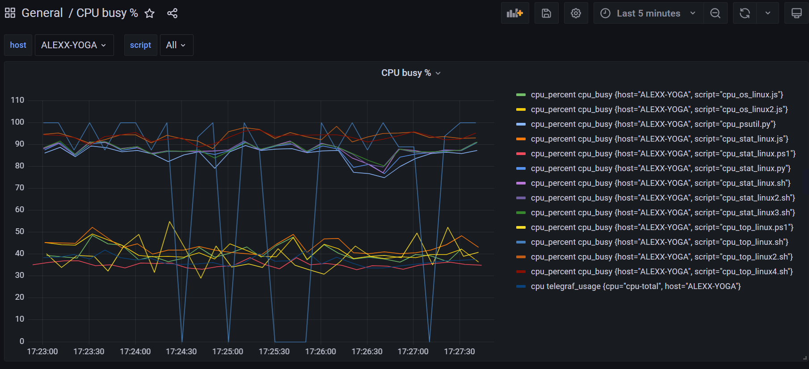
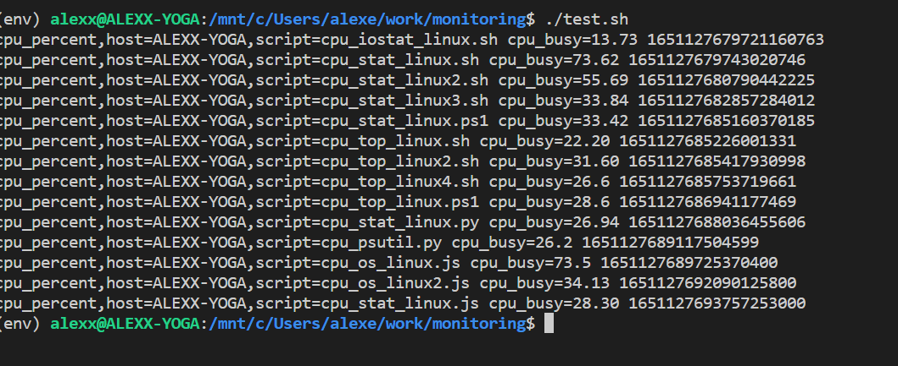

<a href='https://www.grafana.com/'></a>

# Примеры скриптов для мониторинга загрузки ЦПУ

Примеры на разных языках: Power Shell, Node.js,Python,bash

Это скрипты для понимания разных подходов и алгоритмов вычисления загрузки ЦПУ.
linux -  в названии скрипта для ОС Linux
win - для ОС Windows

psutil - использовался модуль psutil
os - модуль os
stat - разбор /proc/stat
top - разбор вывода утилиты top

## Копирование  исходников

```bash
git clone git@github.com:alexxsub/cpu_monitoring.git
cd cpu_monitoring
```

## Установка окружения и зависимостей

### Для  Python

Устанавливаем Python (<https://www.python.org/downloads/>)  
Устанавливаем окружение и ставим пакет psutil

```bash
python3 -m pip install --user --upgrade pip
python3 -m pip install --user virtualenv
python3 -m venv env 
source env/bin/activate
pip install psutil
```

### Для node.js

Установка Node.js (<https://nodejs.org/en/download/package-manager/>)

Нет пакетов сторонних, только нативные, зависимости ставить не нужно

### Для Power Shell

Нужно постаивть терминал Power Shell для Linux (<https://docs.microsoft.com/ru-ru/powershell/scripting/install/installing-powershell-on-linux?view=powershell-7.2>)

### Установка Grafana, InfluxDB,Telegraf

Grafana (<https://grafana.com/docs/grafana/latest/installation/>)
InfluxDB (<https://docs.influxdata.com/influxdb/v1.8/introduction/install/>)
Telegraf (<https://docs.influxdata.com/telegraf/v1.21/introduction/installation/>)

### Настройка переменных окружения

Нужно исправить в файле env.sh под свои данные

PATH_SCRIPT= пусть к скриптам
URL_INFLUXDB= url к influxdb база
TOKEN_INFLUXDB= токен доступа influxdb
ORG_INFLUXDB=название организации
BUCKET_INFLUXDB=корзина

выполнить

```bash
source ./env.sh 
```

### Запустить telegraf

```bash
./run_telegraf.sh
```

Если все установлено верно и настроено, метрики будут собираться в базу

## Скриншоты

**Экран в графане выглядит примерно так**

<p float="left">
        <kbd>

                </kbd>
</p>

### Описание скриптов

test.sh -  запустить все скрипты с выводом в консоль

<p float="left">
        <kbd>

                </kbd>
</p>


cpu_monitor.sh - отображение загрузки в консоли для Linux
сзг_monitor.ps1  - отображение загрузки в консоли для Windows